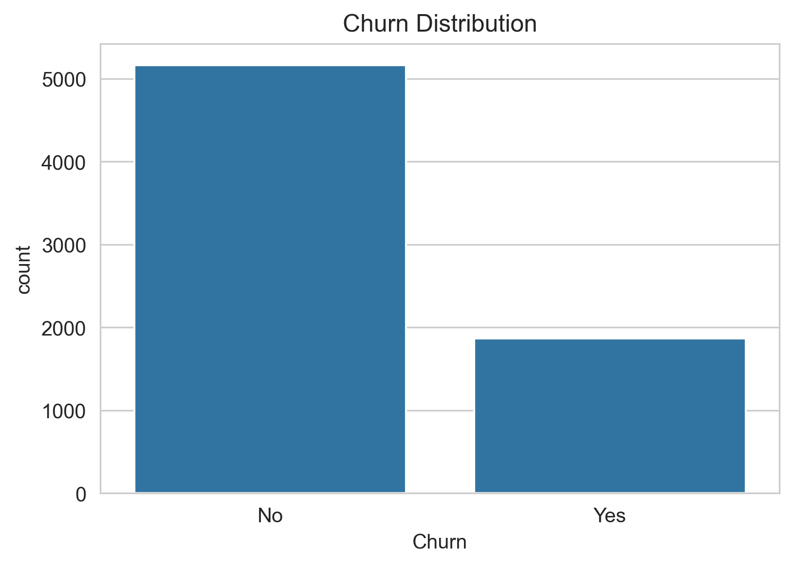
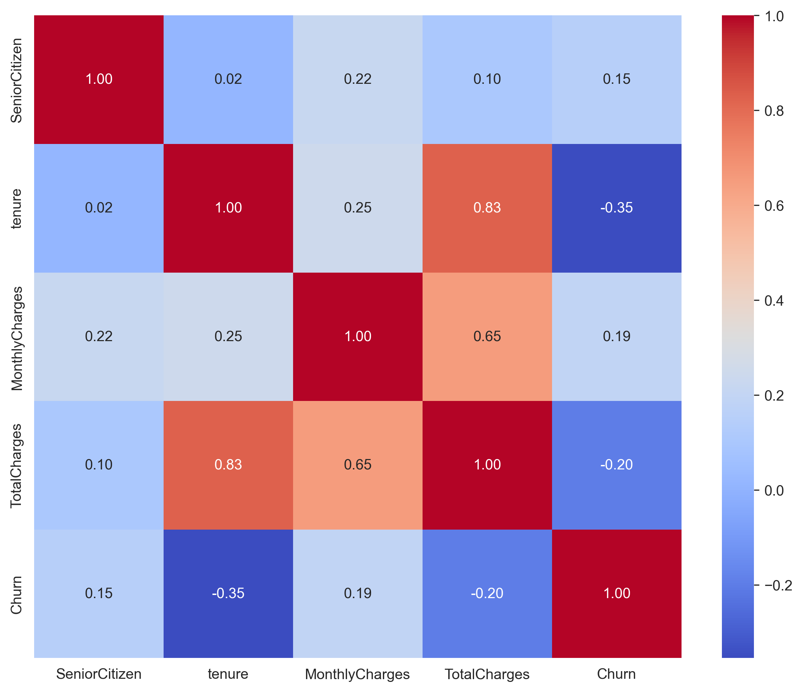
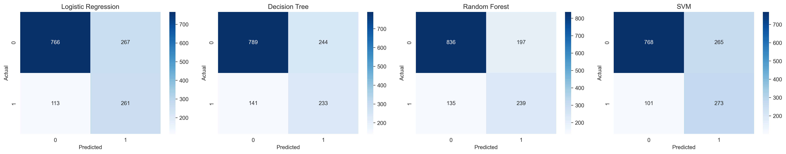
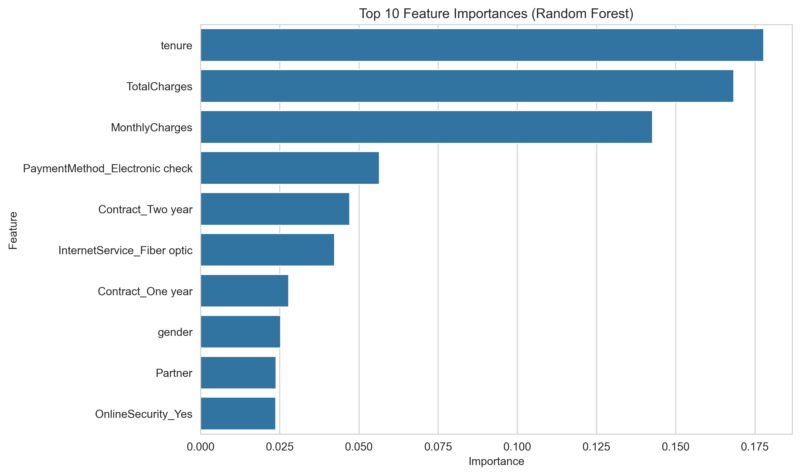

# Customer Churn Prediction


---

# 📌 Project Overview

This project predicts **whether a customer will leave a service (churn) or stay**.

Many companies lose customers every year. By predicting churn early, businesses can take action to **keep their customers**.

In this project, we use the **IBM Telco Customer Churn dataset** and train different machine learning models to find the best one.

---

# ⚙️ Tools Used

Programming Language

* Python

Libraries

* Pandas
* NumPy
* Matplotlib
* Seaborn
* Scikit-learn
* Imbalanced-learn
* Joblib

---

# 📂 Dataset

Dataset used: **IBM Telco Customer Churn Dataset**

It contains information about **7043 customers**, including:

* Gender
* Internet service
* Contract type
* Payment method
* Monthly charges
* Total charges
* Churn status

Target variable:

**Churn**

* 0 → Customer stays
* 1 → Customer leaves

Dataset link:
https://www.kaggle.com/blastchar/telco-customer-churn

---

# 📊 Data Analysis

## Churn Distribution



Most customers do **not churn**, so the dataset is imbalanced.
We solved this using **SMOTE**.

---

## Correlation Heatmap



The heatmap shows relationships between numerical features.

Important observations:

* **Tenure and TotalCharges are strongly related**
* Customers with **low tenure churn more**

---

## Feature Distribution


Observations:

* Customers with **short tenure leave more often**
* **High monthly charges increase churn**
* **Long contracts reduce churn**

---

# 🔄 Data Preparation

Steps performed before training models:

* Cleaned the data
* Converted text features into numbers
* Scaled numerical features
* Split data into **training and testing sets**
* Used **SMOTE** to balance the dataset

Original data:

0 (No churn) → 5163
1 (Churn) → 1869

After SMOTE:

0 → 4130
1 → 4130

---

# 🤖 Models Used

We trained four machine learning models:

1. Logistic Regression
2. Decision Tree
3. Random Forest
4. Support Vector Machine (SVM)

---

# 📈 Model Results

| Model               | Accuracy | Precision | Recall   | F1 Score |
| ------------------- | -------- | --------- | -------- | -------- |
| Logistic Regression | 0.73     | 0.49      | 0.70     | 0.58     |
| Decision Tree       | 0.73     | 0.49      | 0.62     | 0.55     |
| Random Forest       | **0.76** | **0.55**  | 0.64     | **0.59** |
| SVM                 | 0.74     | 0.51      | **0.73** | 0.60     |

**Random Forest performed the best overall.**

---

# 📊 Confusion Matrices



These charts show how well each model predicted churn and non-churn customers.

---

# 🔍 Important Features



Top factors that affect churn:

* Tenure
* Total charges
* Monthly charges
* Payment method
* Contract type

---

# 💡 Business Insights

From this project we learned:

* Customers with **short tenure are more likely to leave**
* **Higher monthly charges increase churn**
* **Long-term contracts reduce churn**
* Customers using **electronic check payments churn more**

Companies can use this information to **reduce customer loss**.

---

# 🚀 How to Run the Project

### 1 Clone the repository

```bash
git clone https://github.com/Thanushya56/customer-churn-prediction.git
```

### 2 Go to the project folder

```bash
cd customer-churn-prediction
```

### 3 Create virtual environment

```bash
python -m venv venv
```

Activate it

Windows

```bash
venv\Scripts\activate
```

Mac / Linux

```bash
source venv/bin/activate
```

### 4 Install libraries

```bash
pip install pandas numpy matplotlib seaborn scikit-learn imbalanced-learn joblib
```

### 5 Run the project

```bash
python churn_prediction.py
```

The script will:

* Analyze the data
* Train machine learning models
* Show charts
* Save the best model

---

# 📁 Project Structure

```
ML_Project
│
├── churn_prediction.py
├── churn_model.pkl
├── scaler.pkl
├── README.md
│
└── images
    ├── churn_distribution.png
    ├── churn_features.png
    ├── correlation_heatmap.png
    ├── confusion_matrices.png
    └── feature_importance.png
```

---

# 💾 Saved Files

After running the project, two files are saved:

```
churn_model.pkl
scaler.pkl
```

These files can be used later to **predict churn for new customers**.

---

# 🔮 Future Improvements

Possible improvements:

* Tune model parameters
* Try advanced models like **XGBoost**
* Build a **Streamlit web app**
* Add explainable AI (SHAP)

---

# 👩‍💻 Author

Thanushya

GitHub:
https://github.com/Thanushya56
